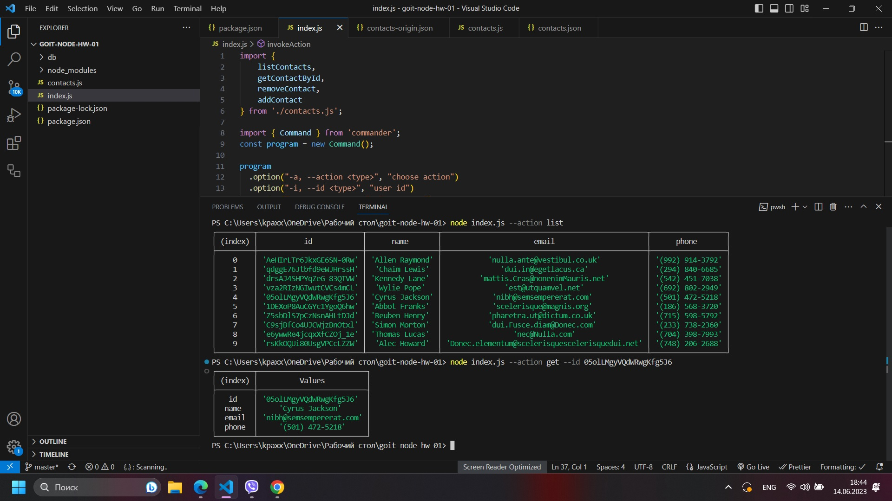

Домашнее задание NodeJS #1

Скриншоты на стороннем облаке (перейти по ссылке)

<ul>
<li>https://ibb.co/yBFXNh5</li>
<li>https://ibb.co/Jd4pWK2</li>
<li>https://ibb.co/L58WnFG</li>
<li>https://ibb.co/cQkj0Cx</li>
</ul>

Скриншоты на Git

